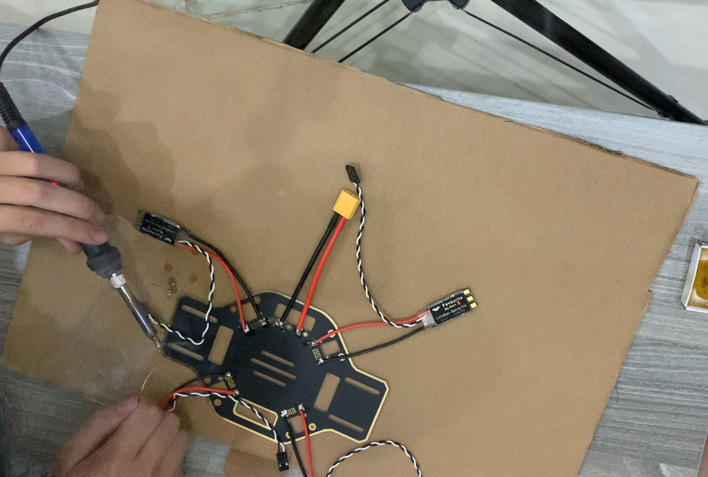
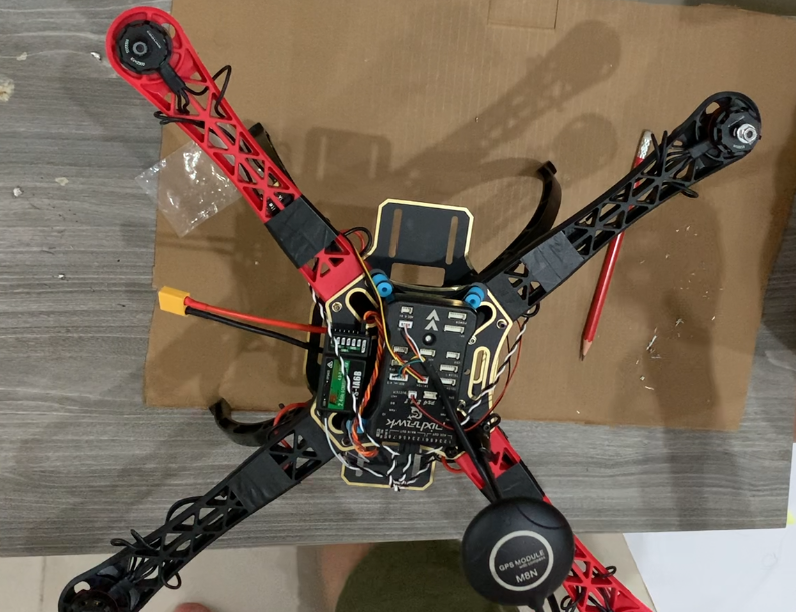

# MediCopter: DIY Automated Drone for Medical Supply Delivery!

Welcome to our space! We are Quy, Vinh, and Khoa from Gia Dinh High School, Vietnam. Our project is MediCopter, an automated drone to deliver medical supply to rurals areas. In this github documentation, you can find our journey to build it from stratch, codes, and media. You can also listen to our presentation at the end of this document.

# Introduction
Our drone primarily consist of multicopter frame, various sensors, and a power manangement system. In order to run automatically, there is an **Raspberry Pi 4** that run Python script to maneuver the drone to the desired duration, meanwhile sending GPS location back to the computer and detecting obstacles. To ensure smooth flight, there is a **Pixhawk 2.4.8** fly controller that control the balance of the flight using PID, which we had tune for better balance.
## Motivation:
In the Mekong Delta, which is an rural area located in the southern Vietnam, there is **44%** of hospitals that are not equipped with sufficient medical supplies, leading to the emergence of on-demand medicals. In the emergency need of a certain medical supply, the traditional vehicles, like ambulance, are not capable of reaching these hospitals on-time, leading to bad situations.

That is why we developed MediCopter, a solution that can significantly speed up the transportation times of medical supplies by using drones, one of the most modern means of transportation. With the capabilities of holding up to 2kg, and peak speed of 100 km/h, MediCopter can deliver most of the supplies needed for an emergency.
## Key features

* Capable of holding maximum of 2kg by the 3D printed arm and servor
* Automatically fly to the destination by using GPS and automatically update on the server
* Using Object Detection to detect obstacles like bird, kites, building during maneuver

# Materials

## Hardware component

| Part                   | Components                                 | Description                         |
|------------------------|--------------------------------------------|-------------------------------------|
| **Multicopter Frame**  | Frame with Power Distribution Board        | Main structure for the drone       |
|                        | 4 x 11x4.5 Propellers                       | Provides lift                       |
|                        | 4 Arms                                     | Supports propellers                 |
|                        | 5000mAh LiPo Battery                         | Power source                       |
|                        | 4 x 40A Electronic Speed Controllers (ESC) | Controls motor speed                |
|                        | 980 kV Brushless Motor                      | Drives propellers                   |
| **Flight Controller**  | Raspberry Pi 4                              | Onboard processing                  |
|                        | Pixhawk 2.4.8                              | Flight control system               |
|                        | GPS                                         | Navigation                          |
| **Add-ons**            | Raspberry Pi Camera                         | Captures images and video           |
|                        | Microphone & Speaker                        | Audio input and output              |
|                        | SIM Module                                  | Cellular connectivity                |
|                        | USB Camera (for detecting landing area)    | Assists in landing detection        |

## Software Apps and Online Services

| Software/Service         | Purpose                                           |
|--------------------------|---------------------------------------------------|
| **ArduPilot**            | Provides tools for PID tuning and calibration of the drone's flight controller. Allows fine-tuning of performance and stability. |
| **Python Libraries**     | Essential libraries used for development:   |
|                          | - **DroneKit**: Enables communication with the drone and control of flight operations.  |
|                          | - **OpenCV**: Used for image processing and computer vision tasks, such as object detection and tracking. |
| **Firebase**             | Facilitates real-time location monitoring and data storage for the drone, allowing remote access to telemetry data. |
| **TensorFlow Lite**      | Enables deployment of the MobileNet-SSD object detection model on the Raspberry Pi, allowing real-time object detection capabilities. |
| **SolidWorks**           | Provides tools for 3D modeling and rendering of drone components, enabling visualization and design optimization. |

## Hand Tools and Fabrication Tools

| Tool                     | Purpose                                           |
|--------------------------|---------------------------------------------------|
| **3D Printer**           | Used for creating custom parts and components for the drone, allowing for rapid prototyping and design iterations. Supports various materials to enhance structural integrity. |
| **Electric Soldering Iron** | Essential for soldering electronic components onto the drone's circuit boards, ensuring reliable connections for optimal performance. Ideal for custom wiring and repairs. |

# Workflow
The workflow consists of 3 objects: Computer, Raspberry Pi, Pixhawk (Flight Controller)
## Pre-flight
1. **Connection**: The Raspberry Pi connects to the ThinkPad via Dynamic DNS and SSH. 
2. **Command Execution**: Commands are sent from the computer to execute Python scripts on the Raspberry Pi. 
3. **Preflight Setup**: Sensor calibration and battery checks are performed. 
## Mid-air
4. **Takeoff**: The Raspberry Pi commands the flight controller to spin the propellers. 
5. **Flight**: The flight controller adjusts motor speeds based on sensor data for stability. 
6. **Navigation**: The drone uses GPS for positioning and follows waypoints or manual inputs. 
7. **Video Streaming**: Video streaming is initiated. 
8. **Obstacle detection**: Detect obstacles (bird, building, etc)
## Landing
9. **Landing**: The flight controller commands the drone to gradually descend and land.
    
This workflow is mainly commanded by Raspberry Pi - Pixhawk Combination.

Example code:

# Building Process
Our journey have 2 phase: manual control (only Pixhawk) and autonomous control (Pixhawk and Raspberry Pi). You can find our assemling process in this youtube playlist.

## Phase 1: Manual control with Pixhawk
### Building the frame
1. Connect Electronic Speed Controller (ESC) to Power Distribution Board (PDB)

2. Connect Brushless Motors to Arms

3. Connect Arms to PDB

4. Connect Battery to PDB

5. Connect Pixhawk to PDB

6. 3D printed the legs. The `.stl` file can be found in the folder `3D_components`.

https://github.com/user-attachments/assets/169ed1b9-fe8f-40f5-9008-af87535a27e2

### Pixhawk Set-up
7. Calibration and PID Tuning with Ardupilot

8. Spinning test #1. At this point, 2 ESCs burns, so we have to upgrade ESCs.
9. Connect new ESCs

8. Connect propellers

https://github.com/user-attachments/assets/d012decf-739c-4128-b322-1b5544648ba4

9. Spinning test #2. This time it spins perfectly
10. Field test #1 with controller.

https://github.com/user-attachments/assets/e171f9fb-7b1c-440d-8f37-c7a3fa3b547b

## Phase 2: Autonomous control
### Raspberry Pi Set-up
1. Connect Raspberry Pi

https://github.com/user-attachments/assets/7c1b4f54-8426-4d72-b6c0-2fdf0d123a5a

2. Connect Servo for Box Grabber. The 3D print file can be found at `3D_components/BoxGrabberPart1.stl` and `3D_components/BoxGrabberPart2.stl`
   
https://github.com/user-attachments/assets/4f15eef7-565c-4d65-8523-65f59fb4e886

3. Field test #2, automatic 

4. Designing Medical Box

https://github.com/user-attachments/assets/9040f761-5fff-42a1-a158-d3721a8c6d5b

### Develop MobileNet-SDD model
1. Get building, bird, kite images by web crawling
2. Train the model

https://github.com/user-attachments/assets/8a863976-2954-48e5-a756-10348f319502   

3. Deploy on Raspberry Pi

https://github.com/user-attachments/assets/92360678-1291-4f0b-8a1d-1a17bf62b5d6

### Camera Module
https://github.com/user-attachments/assets/2ed117ee-a2e5-4d44-a882-4a480ddee704
# Results & Achievements
On the demo of Aug 2023, our prototype are capable of flying automatically fly from point A to point B, and land safely. 

https://github.com/user-attachments/assets/ffb7f6d2-7564-45cc-9413-335dbed1bee8

This is a big win for us for the whole summer. Then, we validate our drone by bringing it into an innovation competition and won a Gold Medal. You can find the video of our presentation below by clicking into it:

*AI-JAM Presentation Video*

# Further development

Although we have succesfully develop other add-on like object detection, our drone are not capable of dodging the obstacle in real-time. This is one of the main development that we can improve in the future. For further distance and more payload, we can upgrade our battery and motors.
